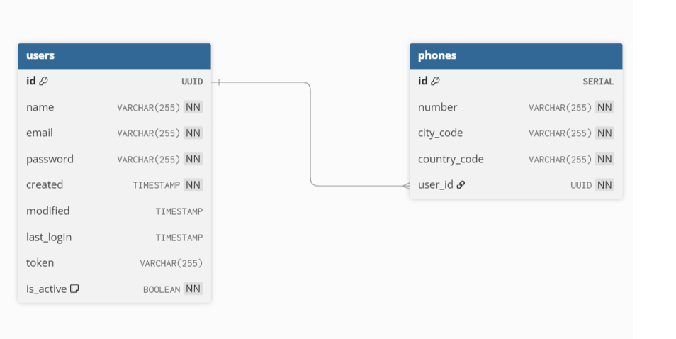

# User Management API

## Descripción

API RESTful para registro y autenticación de usuarios desarrollada con Spring Boot 3.3.4 y Java 17. La aplicación implementa principios SOLID, Clean Code y Domain-Driven Design (DDD) con separación clara entre capas.

## Características Técnicas

- **Framework**: Spring Boot 3.3.4
- **Java**: Versión 17
- **Base de Datos**: H2 en memoria
- **Autenticación**: JWT (JSON Web Tokens)
- **Documentación**: Swagger/OpenAPI
- **Arquitectura**: DDD con separación de capas
- **Patrones**: Factory, Builder, Strategy, Specification
- **Testing**: JUnit 5 y Mockito

## Arquitectura

La aplicación sigue los principios de DDD con la siguiente estructura de capas:

```
src/main/java/com/nisum/app/user-management-api/
├── application/
│   └── service/           # Servicios de aplicación (casos de uso)
├── domain/
│   ├── factory/          # Factory para creación de entidades
│   ├── model/            # Entidades del dominio
│   ├── repository/       # Interfaces de repositorio
│   └── specification/    # Especificaciones de validación
└── infrastructure/
    ├── config/          # Configuraciones
    ├── controller/      # Controladores REST
    ├── dto/            # DTOs de entrada y salida
    └── exception/      # Manejo de excepciones
    └── security/       # Manejo de filtros de jwt e implementacion de UserDetailsService
```

## Endpoints

### 1. Registro de Usuario
- **URL**: `POST /api/users`
- **Content-Type**: `application/json`

**Request Body:**
```json
{
  "name": "Juan Rodriguez",
  "email": "juan@rodriguez.org",
  "password": "Password123",
  "phones": [
    {
      "number": "1234567",
      "citycode": "1",
      "contrycode": "57"
    }
  ]
}
```

**Response (201 Created):**
```json
{
  "id": "a1b2c3d4-e5f6-7g8h-9i0j-k1l2m3n4o5p6",
  "created": "2025-07-30T10:30:00",
  "modified": "2025-07-30T10:30:00",
  "last_login": "2025-07-30T10:30:00",
  "token": "eyJhbGciOiJIUzI1NiIsInR5cCI6IkpXVCJ9...",
  "isactive": true
}
```

**Error Response (400 Bad Request):**
```json
{
  "mensaje": "este correo ya existe"
}
```

### 2. Login de Usuario
- **URL**: `POST /api/login`
- **Content-Type**: `application/json`

**Request Body:**
```json
{
  "email": "juan@rodriguez.org",
  "password": "Password123"
}
```

**Response (200 OK):**
```json
{
  "id": "a1b2c3d4-e5f6-7g8h-9i0j-k1l2m3n4o5p6",
  "created": "2025-07-30T10:30:00",
  "modified": "2025-07-30T10:30:00",
  "last_login": "2025-07-30T10:30:00",
  "token": "eyJhbGciOiJIUzI1NiIsInR5cCI6IkpXVCJ9...",
  "isactive": true
}
```

**Error Response (400 Bad Request):**
```json
{
  "mensaje": "Credenciales inválidas"
}
```

### 3. Obtener informacion de usuario
- **URL**: `GET /api/profile/me`
- **Content-Type**: `application/json`

**Response (200 OK):**
```json
{
  "id": "a71e0d9a-c385-40a0-a9d9-852f2fd312a1",
  "created": "2025-08-01T00:36:43.806918",
  "modified": null,
  "token": "eyJhbGciOiJIUzI1NiIsInR5cCI6IkpXVCJ9...",
  "name": "juan",
  "last_login": "2025-08-01T00:36:43.806918",
  "isactive": true
}
```

**Error Response (401 Unauthorized ):**


## Validaciones

### Email
- Formato estándar de email usando regex configurable
- Verificación de unicidad en la base de datos

### Password
- Regex configurable (por defecto: mínimo 8 caracteres, al menos una mayúscula, una minúscula y un número)
- Almacenamiento seguro con BCrypt

## Configuración

Las siguientes propiedades son configurables en `application.properties`:

```properties
# JWT Configuration
app.jwt.secret=mySecretKey123456789mySecretKey123456789
app.jwt.expiration=86400000

# Password Validation Regex
app.password.regex=^(?=.*[a-z])(?=.*[A-Z])(?=.*\\d)[a-zA-Z\\d]{8,}$

# Email Validation Regex
app.email.regex=^[A-Za-z0-9+_.-]+@(.+)$
```

## Instalación y Ejecución

### Prerrequisitos
- Java 17 
- Maven 3.5 en adelante

### Ejecucion manual

1. **Clonar proyecto**

   git clone https://github.com/coyoteroger/user-management-api.git
   cd user-management-api

2. **Compilar el proyecto:**
   ```bash
   mvn clean compile install
   ```

3. **Ejecutar las pruebas:**
   ```bash
   mvn test
   ```

4. **Ejecutar la aplicación:**
   ```bash
   mvn spring-boot:run
   ```

   O compilar y ejecutar el JAR:
   ```bash
   mvn clean package
   java -jar target/user-management-api-1.0-SNAPSHOT.jar
   ```

5. **Acceder a la aplicación:**
   - API: http://localhost:8080
   - Swagger UI: http://localhost:8080/swagger-ui/index.html
   - H2 Console: http://localhost:8080/h2-console

## Documentación API

Una vez iniciada la aplicación, puedes acceder a la documentación interactiva de la API:

- **Swagger UI**: http://localhost:8080/swagger-ui/index.html
- **OpenAPI JSON**: http://localhost:8080/v3/api-docs

## Base de Datos

La aplicación utiliza H2 en memoria para facilitar las pruebas y desarrollo:

- **URL**: jdbc:h2:mem:testdb
- **Usuario**: sa
- **Contraseña**: (vacía)
- **Console**: http://localhost:8080/h2-console

## Testing

El proyecto incluye pruebas unitarias comprensivas:

- **UserServiceTest**: Pruebas del servicio principal
- **JwtServiceTest**: Pruebas del servicio JWT
- **EmailValidationSpecificationTest**: Pruebas de validación de email
- **PasswordValidationSpecificationTest**: Pruebas de validación de contraseña
- **UserFactoryTest**: Pruebas del factory de usuarios
- **UserControllerTest**: Pruebas de integración del controlador
- **ProfileControllerTest**: Pruebas de integración del controlador
- **TestSecurityConfig**: Pruebas de simulacion de seguridad

Ejecutar todas las pruebas:
```bash
mvn test
```

## Características de Seguridad

- Contraseñas encriptadas con BCrypt
- Tokens JWT firmados con clave secreta configurable
- Validaciones robustas de entrada
- Manejo global de errores
- Headers de seguridad HTTP


## Dependencias Principales

- Spring Boot 3.3.4
- Spring Data JPA
- Spring Validation
- H2 Database
- JJWT (JSON Web Token)
- Lombok
- SpringDoc OpenAPI
- JUnit 5
- Mockito

## Consideraciones de Desarrollo

- Código limpio y documentado
- Principios SOLID aplicados
- Inyección de dependencias correcta
- Separación de responsabilidades
- Manejo adecuado de excepciones
- Logs estructurados


## Diagrama de base de datos

script de la base de datos -> /scriptDB.sql

